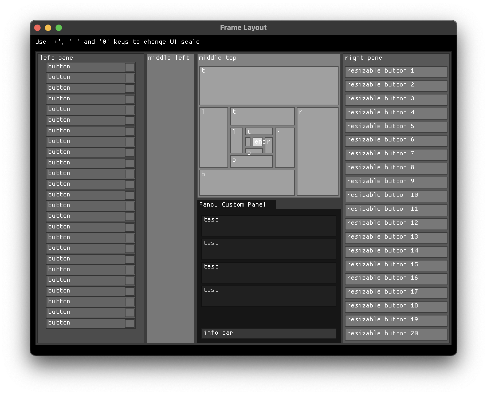

# Layframe

An **_immediate mode_**, minimalist, **_no_std_** and **_no allocations_** layout library for rectangular elements (Frames), intended for games, embedded systems, and other constrained environments.

While easy to use, Layframe's approach is very limited and can't create complex layouts! There's simply the function [Frame::add()], to add fixed size elements, and [Frame::fill()] for proportional elements. Both can operate from any side (Left, Right, Top, and Bottom). Repeatedly adding from the same side is analogous to using a "Row" or "Column" in a more complex GUI library.

(More features will be added in the future.)

It does not have any knowledge of fancy things like *rendering* and *input*. Instead, it provides you with closures that are aware of their parent Frame's rectangle and available space, and you do the rendering and input yourself.

It also does not know in advance the size of the children, so you may need to do the math yourself within the closure before adding children, although this is planned to be easier in the future. You can use the [Frame::cursor()] method to check the available space after margin is applied, or [Frame::rect()] to get the closure's rectangle.



Two examples are provided: a more complex one using Macroquad for rendering, and a very simple one using MiniSdl (which in turn uses SDL2).

## Usage Example

```rust
use layframe::{Frame, Rect, Side::*};

fn main() {
    // Create a root frame
    let mut root = Frame::new(Rect {
        x: 0,
        y: 0,
        w: 800,
        h: 600,
    });

    // Add a header at the top
    root.add(Top, 60, |header| {
        // Add a logo to the left of the header
        header.add(Top, 100, |logo| {
            // You can acquire this rectangle using logo.rect(),
            // and draw it with your favorite graphics crate.
        });

        // Add navigation buttons to the right
        header.add(Right, 200, |nav| {
            // Navigation content
            for _ in 0..10 {
                nav.add(Top, 40, |_button| {
                    // This "button" is a smaller rect within nav, stacked from the top
                })
            }
        });
    });

    // Add a dynamic sidebar using 20% of the remaining space (ratio = 0.2)
    root.fill(Left, 0.2, |_sidebar| {
        // Sidebar content
    });

    // Main content area (use remaining space with ratio = 1.0)
    root.fill(Left, 1.0, |_content| {
        // Main content
    });
}
```

## Features

- **Immediate Mode**: Simple and direct with minimal setup.
- **No Standard Library Dependencies**: Works in embedded environments with `no_std`
- **Nested Layouts**: Create hierarchical frame structures
- **Flexible Positioning**: Add child frames to any side (left, right, top, bottom)
- **Margin & Gap Control**: Fine-tune spacing between elements
- **Proportional Layouts**: Allocate space by ratio with the `fill()` method
- **Scaling Support**: Adjust all elements with a scale factor
- **Generic Numeric Support**: Works with various numeric types (u16, f32, etc.)

## License

MIT License
